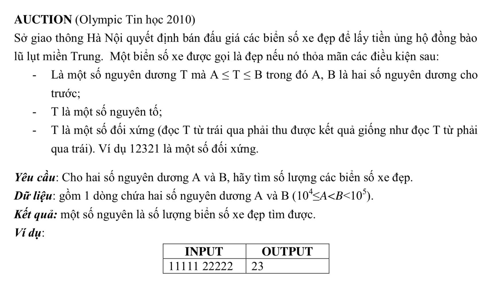

# AUCTION



## C++

```c++

/*
 Nguyen Dinh Toan 18CNTT04
 user008
 
 */


#include <iostream>
#include "math.h"


using namespace std;


bool isPrimeNumber(int num){
    
    double tmp = (double) num;
    
    if(num < 2){
        return false;
    }
    for (int i = 2; i <= sqrt(tmp); i++) {
        if(num % i == 0){
            return false;
        }
    }
    return true;
}

bool soDep(int num){
    
    int value = num;
    
    // tach tu chu so cua so do ra va
    int inc = 0;
    
    
    while (value > 0) {
       
        value /= 10;
        
        inc++;
        
    }
    
    int digits[inc];
    int revertDigits[inc];
    
    int numb = num;
    
    int increase =0;
    
    while (numb > 0) {
        int d = numb % 10;
        
        numb /= 10;
        
        digits[increase] = d;

        
        increase ++;
        
    }
    

    int revertInc = 0;
    
    for (int i = increase - 1; i >=0; i--) {
        revertDigits[revertInc] = digits[i];
        
        
        revertInc ++;
    }
    
    // kiem tra cac phan tu mang digits va revertDigits xem co giong nhau khong
    bool isGood = true;
    
    for (int i = 0; i < increase; i++) {
    
        
        if(digits[i] != revertDigits[i]){
            isGood = false;
            
            break;
        }
    }
    
    
    return isGood;
}


int main(){
    
    int a;
    int b;
    int t = 0;
    
    
    cin >> a;
    cin >> b;
    
    // lap tu A ->B va lay tat ca cac so nguyen to
    int max = b-a; // Du doan tong so phan tu trong mang
    int arr[max];
    
    int inc = 0;
    
    for (int i = a; i< b; i++) {
        if(isPrimeNumber(i)){
            // la so nguyen to
            arr[inc] = i;
            inc++;
            
        }
    }
    // ta da co duoc 1 mang gom tat ca so nguyen to
    

    
    for (int i = 0; i<inc; i++) {
       
        bool sd = soDep(arr[i]);
        
        if(sd){
            t++;
        }
       
    }
     cout <<t;
    
}


```