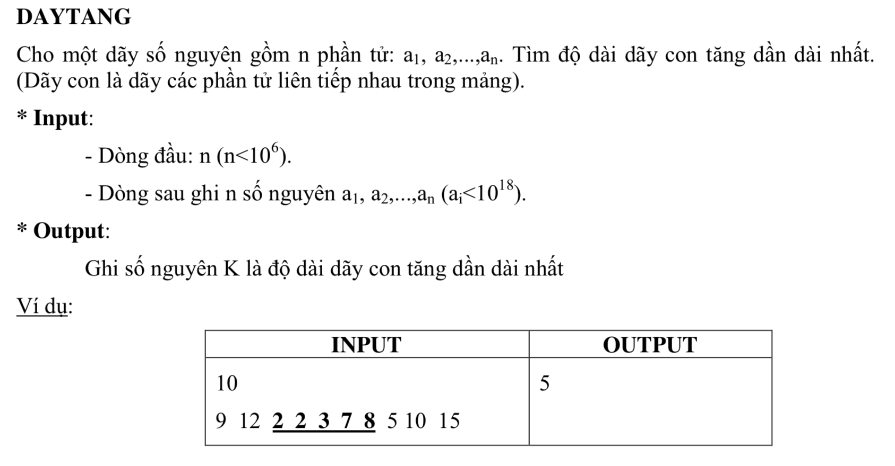

# DAY TANG



## C++

```c++
/*
 Nguyen Dinh Toan 18CNTT04
 user008
 
 */


#include <iostream>

using namespace std;

int n;

int main(){
    
    cin >> n;

    int numArr[n];
    
    for (int i=0; i<n; i++) {
        cin >> numArr[i];
        
    }
    
    int maxLength = 0;
    
    int length = 1;
    int lastNum = numArr[0];
    for (int i = 1; i<n; i++) {
        int num = numArr[i];
        
        if(num >= lastNum){
            length ++;
           
            
            
            if(length > maxLength){
                maxLength = length;
            }
        
        }else{
            length = 1;
        }
        
        lastNum = num;
    }
    
    cout << maxLength;
    
    return 0;
}


```