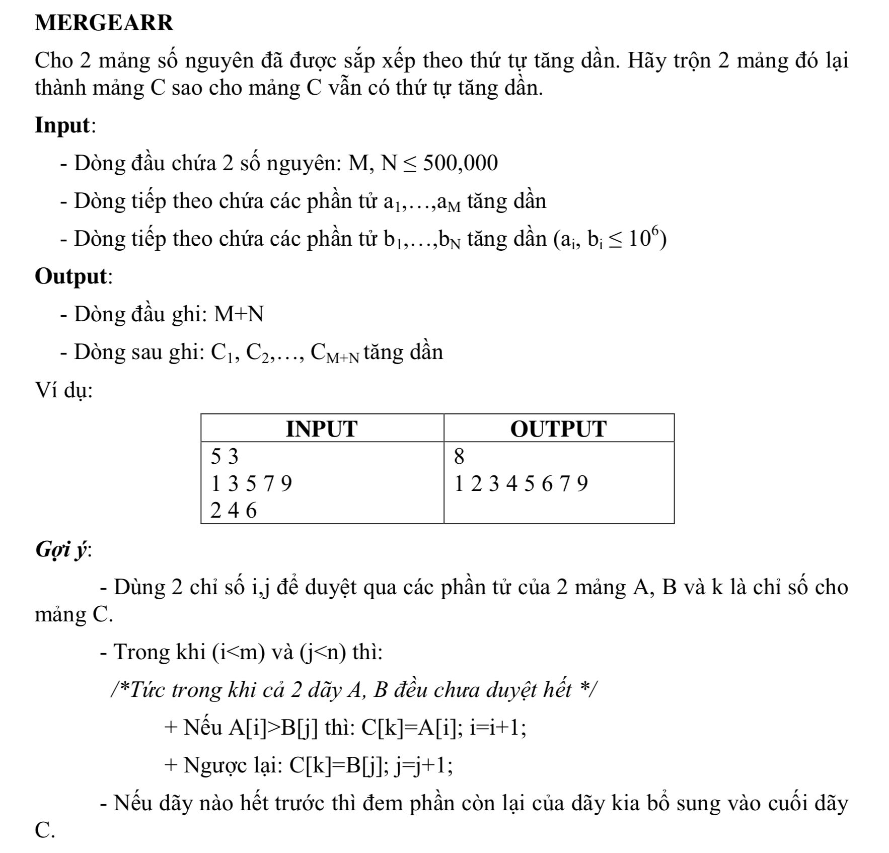

#MERGEARR




## C++

```c++
/*
 Nguyen Dinh Toan 18CNTT04
 user008
 
 */


#include <iostream>
#include "math.h"


using namespace std;


bool isNumExist(int *arr, int number, int max){
    
    for (int i = 0; i < max; i++) {
        if(arr[i] == number){
            return true;
        }
    }
    return false;
}

int  main(){
    
    
    int m = 1;
    int n = 1;
    
;
    
    cin >> m;
    cin >> n;
    
    int count = m +n;
    int numArr[count];
    int num = 0;
    int increase = 0;
    
    for (int i = 0; i < m +n; i++) {
        cin >> num;
        bool isExist = isNumExist(numArr, num, increase);
        cout << isExist;
        if(!isExist){
            numArr[increase] = num;
            increase++;
        }
        
    }
    
    // sap xep tang dan cach don gian nhat va cham nhat
    for (int i = 0; i < increase; i++) {
        for (int j = i; j < increase; j++) {
            if(numArr[j] < numArr[i]){
                // doi cho
                const int minNumber = numArr[i];

                numArr[i] = numArr[j];
                
                numArr[j] = minNumber;
            }
        }
    }
    
    // output
    
    cout << m+n << endl;
    for (int i = 0; i < increase; i++) {
        cout << numArr[i] << " ";
    }
    
    return 0;
}


```