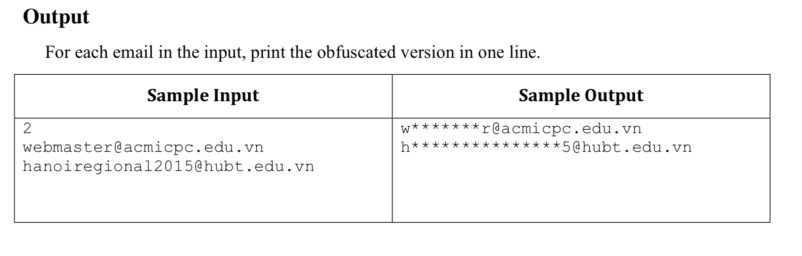

# Problem A: Obfuscated Emails

Celebrating its 10 years anniversary, acmicpc.edu.vn website has just announced a lucky draw for their users. N users have been selected randomly to receive a special prize. They will announce N winners’ emails. However, stating the full emails of the winners in public is not a good idea because they might receive a lot of spam emails. Thus, the website will only publish the obfuscated emails.
An email consists of 3 parts: a username with a minimal of 3 characters, a special character @ and the mail server domain. For example, in an email “webmaster@acmicpc.edu.vn”, “webmaster" is the username, “acmicpc.edu.vn" is the domain.
To obfuscate this email, we will keep the first and last character of the username, replace other characters in the username with character * (the asterisk, ASCII 42); the remaining part of the email stays intact. Thus “webmaster@acmicpc.edu.vn” will become “w*******r@acmicpc.edu.vn”.
Your task is to obfuscate the emails of N winners. Input
The input starts with a number N (N ≤ 20) - the number of winners on a single line, followed by N winners’ emails where each email is on a separate line. These emails are guaranteed to be valid (only consists of lowercase letters, digits, the dot or full stop and the character @).



## C++


```c++


/*
 Problem A: Obfuscated Emails
 */

#include <iostream>
#include <string>

using namespace std;


int main(){
    

    
    int n;
    cin >> n;
    
    string stringArr[n];
    string s;
    
    for (int i = 0; i < n; i++) {
        cin >> s;
        
        for (int j=0; j< s.size(); j++) {
            if(j == 0){
                continue;
            }
            if(s[j] == 64){
                // gap @
                break;
            }
            s[j] = 42; //*
        }
        stringArr[i] = s;
    }
    
    
    for (int i = 0; i<n; i++) {
        
        string ss = stringArr[i];
        
        int lenght = (int) ss.size();
        for (int j=0; j<lenght ; j++) {
            cout << ss[j];
        }
        cout << endl;
    }
    
    return 0;
}


```