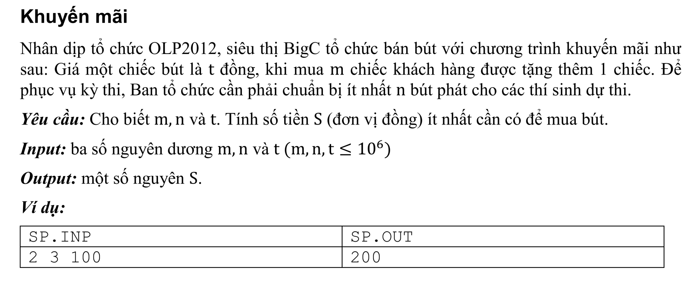

## C++



```c++
/*
 Đề bài:
 m: số bút mua sẽ được tặng thêm 1 cái
 n: tổng số bút cần phải mua
 t: là số tiền cho 1 cái bút
 
 
 gọi x là số bút phải trả tiền
 gọi y là số bút được khuyến mãi
 
 khi đó:
 x + y = n (*)
 
 như vậy số bút cần phải mua là n - y;
 
 
 Cứ mua m cái sẽ được tặng thêm 1 cái. vậy khi mua n - y cái sẽ được khuyến mãi là (n-y)/m
 
 => x + (n -y)/m = n;
 
 
 y = n-y/m
 my - n +y = 0;
 (m +1)*y = n;
 
 y = n/m+1
 
 x + n/(m+1) = n;
 
 x = n - n/(m+1)
 
 vậy tổng số tiền phải trả là = x * t;
 */

#include <iostream>
using namespace std;
int main(){
    
    int m, n, t;
    cin >> m;
    cin >> n;
    cin >>t;
    int x =  n - n/(m+1);
    
    cout << x *t;
}


```


## Cách 2 (Tiên 18CNTT04)

```c++

#include <iostream>
using namespace std;
main(){
    int m,n,t,but,tien,dem;
    cin>>m>>n>>t;
    but=0;
    tien=0;
    dem=0;
    while (but<n){
        ++but;
        ++dem;
        tien=tien+t;
        if (dem==m){
            ++but;
            dem=0;
        }
    }
    cout<<tien;
}


```