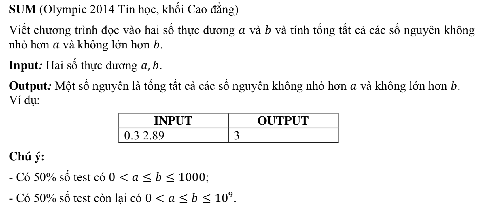

# SUM



## C++

## Sử dụng công thức


```
tổng n + m; // n < m

t = (m+n)* so luong phan tu/2;

tong = (m +n) * ((m -n)+1)/2


```


```c++
/*
 Nguyen Dinh Toan 18CNTT04
 user008
 
 */


#include <iostream>
#include "math.h"


using namespace std;

int main(){
    
    float a;
    float b;
    
    long int sum = 0;
    
   
    
    
    cin >> a;
    cin >> b;
    
    
    
    //tong = (m +n) * ((m -n)+1)/2
    
    int n = (int)a + 1;
    
    int m = (int)b;
    
    sum = (m +n) * ((m -n) +1)/2;
    

    cout << sum;
    
    return 0;
    

}

```


## Cách chậm nhất

```c++

/*
 Nguyen Dinh Toan 18CNTT04
 user008
 
 */


#include <iostream>
#include "math.h"


using namespace std;

int  main(){
    
    float a;
    float b;
    long int sum = 0;
    

    
    cin >> a;
    cin >> b;
    

    for (int i=(int) a; i <= (int)b ; i++) {
        sum++;
    }
    
    cout << sum;
    
    return 0;
}


```