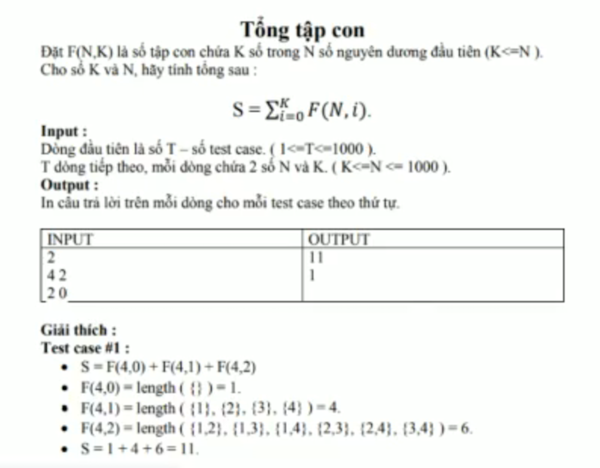

# TONG TAP CON



## C++

```c++
#include <iostream>

using namespace std;


long int gt(int n){
    
    if(n == 0){
        return 1;
    }
    long int gt = 1;
    
    for (int i = 1; i <= n; i++) {
        gt*= i;
    }
    
    return gt;
}

long int C(int n, int k){
    
    return (gt(n)/(gt(k) * gt((n -k))));
}


int main(){
    
    int nTest, n,k;

    cin >> nTest;
    
    int arr[nTest];
    
    
    
    for (int i = 0; i < nTest; i++) {
        cin >> n;
        cin >> k;
        
        int sum = 0;
        for (int j=0; j<=k; j++) {
        
            
            sum += C(n,j);
        }
        
        arr[i] = sum;
        
        
    }
    
    for (int i = 0; i < nTest; i++) {
        cout << arr[i] << endl;
    }
    
    
}


```