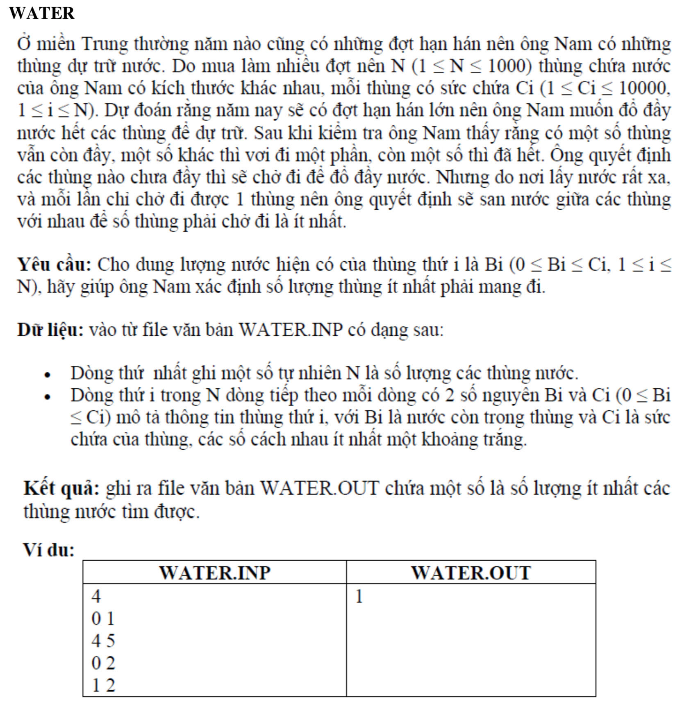

# WATER



## C++


```c++
/*
 User008
 Nguyen Dinh Toan
 18CNTT04
 */


#include <iostream>

using namespace std;


int main() {
    
    int n = 0;


    
    cin >> n;
    
    int arr[n][2]; // mảng hai chiều gồm n thùng
    
    for (int i = 0; i < n; i++) {
        int b;
        int c;
        
        cin >>b;
        cin >> c;
        
        arr[i][0] = b; // Mức nước còn lại
        arr[i][1] = c; // sức chứa của thùng nước
    }
    
    // săp xếp thùng theo thứ tự giảm dần cua suc chua
    
    for (int i = 0; i < n; i++) {
        
    
        
        for (int j =0; j < n; j++) {
            
            // săp xếp giảm dần theo tiêu chí , sức chứa nào to nhất thì xếp đầu tiên
            
            
            if(arr[j][1] < arr[i][1]){
                int tmp1 = arr[i][0];
                int tmp2 = arr[i][1];
                
                arr[i][0] = arr[j][0];
                arr[i][1] = arr[j][1];
                
                arr[j][0] = tmp1;
                arr[j][1] = tmp2;
                

            }
        }
    }
    
    // giờ ta lấy thùng to nhất đổ vào thủng nhỏ nhất, nếu thừa ra thì tiêp tục tìm thùng nhỏ nhất rồi đổ.

    

    int thungNuocCanMangDiDo = 0; // Tên biến dài quá
    
    
    for (int i = 0; i < n; i++) {
        
        //cout << arr[i][0] << " " << arr[i][1] << endl;
        
        int h = arr[i][0]; // muc nuoc con trong thung
        
        for (int j = n -1; j > i ; j--) {
        
            // do lan luot vao thung nho nhat, den khi h = 0; thi ta tang len so luong thung da het +1
            
            // muc nuoc thung can do vao se la: sức chứa - lượng nước còn lại
            int bb = arr[j][1];
            int cc = arr[j][0];
            
            int mucNuocCanThemVao = bb - cc;
        
            
            int mucNuocDaThemVao = mucNuocCanThemVao;
            
            if(mucNuocCanThemVao >= h){
                mucNuocDaThemVao = h;
            }
            
            if(mucNuocCanThemVao != 0 && h > 0){
                // xet neu khac != 0 thi do vao, con khong thi thoi, nghĩa là thùng đã đầy.
                h -= mucNuocCanThemVao;
                
                arr[j][0] = arr[j][0] + mucNuocDaThemVao;
            }
            
            if(h <= 0){
                // thùng đem đi đổ lần lượt vào thùng khác đã hết
                thungNuocCanMangDiDo ++;
            }
            
           
        }
        
    }
    
    cout << thungNuocCanMangDiDo;
    
    return 0;
}


```