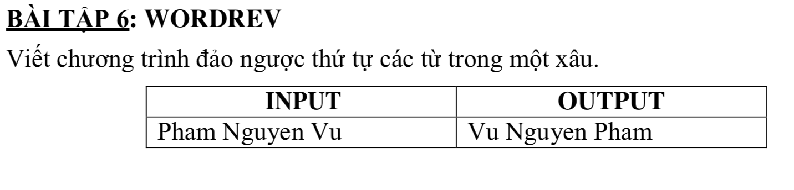

# WORDDEV



## C++

```c++
/*
 MAXWORD
 Teacher: TS.Pham Anh Phuong UED.
 Student: Nguyen Dinh Toan 18CNTT04
 */

#include <iostream>
#include <string>

using namespace std;

string s = "Pham Nguyen Vu";

string result = "";

int main (){
    
    string tmp = "";
    
    for (int i = (int)(s.size() -1); i >= 0; i--) {
        
        if(s[i] != 32){
            tmp += s[i];
        }
        if(s[i] == 32 || i == 0){
            // dao nguoc chuoi tmp
            cout << "size:" << tmp.size() << endl;
            for(int j = (int)(tmp.size() -1); j>= 0; j--){
                //cout << ""<<tmp[j] << ":"<<j << endl;
                result += tmp[j];
            }
            
            tmp.clear();
            if(i != 0){
                result+= " ";
            }
            
        
            
        }
        
    
    }
    
    cout << result;
    
    return 0;
    
}


```