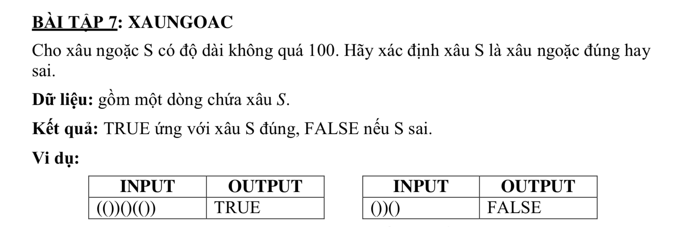

# XAUNGOAC



## C++

```c++

/*
 XAUNGOAC
 Teacher: TS.Pham Anh Phuong UED.
 Student: Nguyen Dinh Toan 18CNTT04
 */

#include <iostream>
#include <string>

using namespace std;

string s;
string conlai;

/*
 ( => 40
 ) =>  41
 
 */


string xoaChuoi(string str, int leftIndex, int rightIndex){
    
    string ss;
    
    for (int i =0; i<str.size(); i++) {

        if(i != leftIndex && i!= rightIndex){
            ss += s[i];
        }
    }
    
    return ss;
}

bool kiemTraDauCuoi(string str){
    
    int stringLength = (int)s.size();
    
    if(str[0] == 41 || str[stringLength -1] == 40){
        return false;
        
    }
    
    return true;
}
int main (){
    
    bool correct = true;
    
    cin >> s;
    
    int length = (int)s.size();
    
    if(!kiemTraDauCuoi(s)){
        cout << "FALSE";
        return 0;
        
    }
    
    // ta xet tung vi tri ben trai, neu no la mo, thi phai tim 1 dau dong tuong ung phia ben phai tu vi tri no , sau do ta bo cap tuong ung ra
    
    for (int i =0; i<length; i++) {
        if(s[i] == 40){
            // open
            // ta tim 1 gia tri phia ben phai la dong va bo di
            bool found = 0;
            
            for(int j=i; j < length; j++){
                if(s[j] == 41){
                    // closed
                    s = xoaChuoi(s, i, j);
                    
    
                    if(!kiemTraDauCuoi(s)){
                        // sai
                        correct = false;
                        found = false;
                        
                        break;
                    }
                    
                    found = true;
                    break;
                }
            }
            if(!found){
                // khong tim thay gia tri dong tuong ung
                correct = false;
                
                break;
            }
        }
    
    }
    
    string result = correct ? "TRUE" : "FALSE";
    cout << result;
    return 0;
    
}


```