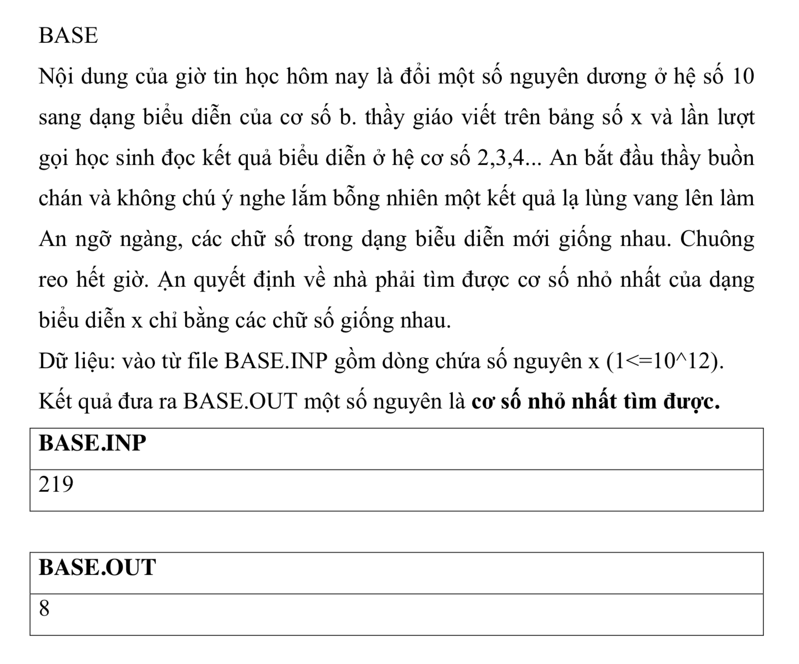

# Base



## C++


```c++

#include <iostream>

using namespace std;

int timB(long long n, int b ){
    int sd = -1;
    long long value = n;
    long long arr[n];
    
    long long inc = 0;
    
    while (value > 0) {
        int soDu = value%b;
        long long currentValue = value / b;
        
        value = currentValue;
        
        if(sd != -1 && sd != soDu){
            
            sd = -1;
            value = n;
            b++;
            timB(n, b);
        }else{
            arr[inc] = soDu;
             sd = soDu;
            inc++;
        }
        
       
    }
    return b;
}
int main(){
    
    long long n = 219;
    
    
    cin >> n;

    int b = 2;

    b = timB(n,b);
    
    cout << b;
    
    return 0;
}


```