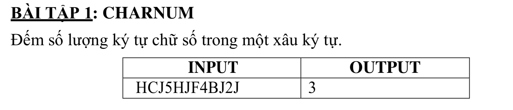

## Charnum



## C++

```c++

#include <iostream>

using namespace std;


int main(){
    
    char s[] = "HCJ5HJF4BJ2J";
    int num = 0;
    
    for (int i=0; i< strlen(s); i++) {
        
        // Tim hieu char trong bang ma ASCII https://vi.wikipedia.org/wiki/ASCII
        if(48 <= s[i] && s[i] <=57){
            num ++;
        }
    }
    
    cout << "So luong ky tu so trong chuoi: " << num << endl;
    
}

```