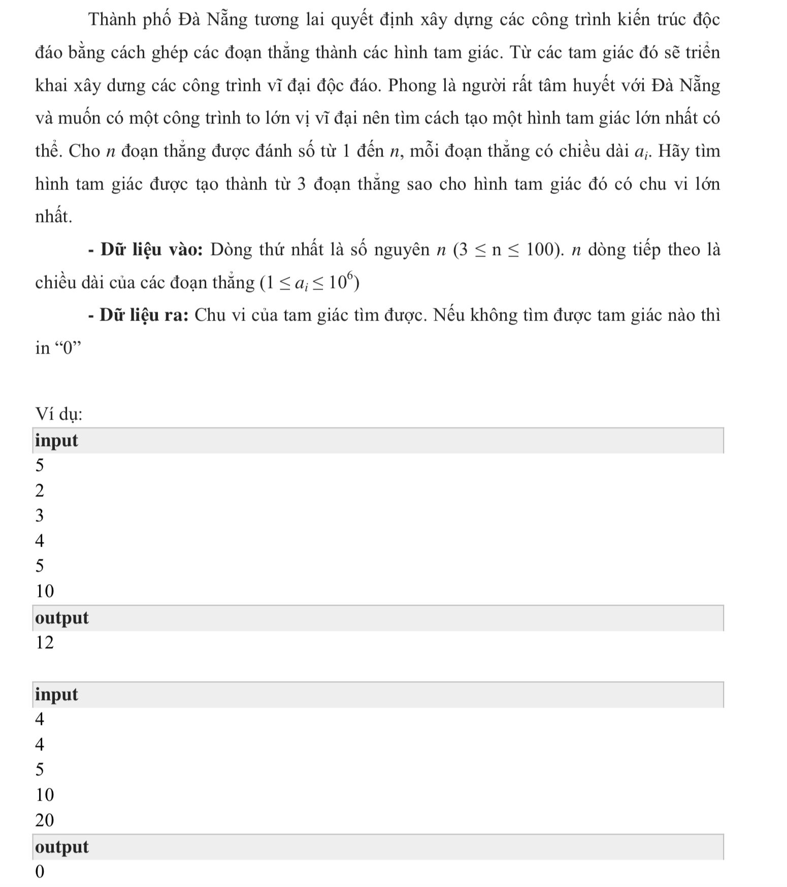

# Đề Bài

Thành phố Đà Nẵng tương lai quyết định xây dựng các công trình kiến trúc độc đáo bằng cách ghép các đoạn thẳng thành các hình tam giác. Từ các tam giác đó sẽ triển khai xây dưng các công trình vĩ đại độc đáo. Phong là người rất tâm huyết với Đà Nẵng và muốn có một công trình to lớn vị vĩ đại nên tìm cách tạo một hình tam giác lớn nhất có thể. Cho n đoạn thẳng được đánh số từ 1 đến n, mỗi đoạn thẳng có chiều dài ai. Hãy tìm hình tam giác được tạo thành từ 3 đoạn thẳng sao cho hình tam giác đó có chu vi lớn
nhất.



## C++

```c++

#include <iostream>
using namespace std;

typedef struct{
    int a;
    int b;
    int c;
} TAMGIAC;


/*
 để 3 cạnh là 1 tam giác thì:
 + Tổng 2 cạnh phải lớn hơn canh còn lại
 + Tam giac vuông cân thì sẽ có chu vi lơn nhất
 */

bool laTamGiac(int a, int b, int c){
    
    if(a ==0 || b == 0 || c== 0){
        return false;
    }
    return (a +b > c && a+c > b && b+c > a);
    
}

/*
 Tinh giai thua cua n
 */
long int giaiThua(int n){
    if(n ==0){
        return 1;
    }
    long int gt = 1;
    
    for (int i =1; i <= n; i++) {
        gt *= i;
    }
    return gt;
}

long int chinhHop(int n, int k){
    
    long int nGT = giaiThua(n);
    long int kGT = giaiThua(k);
    
    return nGT/(kGT * giaiThua(n-k));
    
}

void debugTamGiac(TAMGIAC *tg, long int max){
    
    for (int i =0; i < max; i++) {
        
        cout << tg[i].a << " " << tg[i].b << "  " << tg[i].c << endl;
    }
}


int main(){

    
    int lines;
    int num;
    
    cin >> lines;
    int arr[lines];
    
    
    long int MAX = chinhHop(lines, 3);

    TAMGIAC tg[MAX];
    
    int S = 0;
    for (int i =0; i < lines; i++) {
        cin >> num;
        arr[i] = num;
    }
    

    
    long int inc = 0;
    
    for (int a = 0 ; a < lines; a++) {
        
        int bb = a+1;
        
        for (int b = bb; b < lines; b++) {
            
            int cc = b+1;
            
            for (int c = cc; c < lines; c++) {
        
                // kiem tra xem cach cap a, b, c nay có phải là tam giac không
            
                if(laTamGiac(arr[a], arr[b], arr[c])){
                    
                    // neu la tam giac ta kiem tra chu vi
                    
                    int chuVi = arr[a] + arr[b] + arr[c];
                    
                    if( chuVi > S){
                        S = chuVi;
                    }
                    
                    tg[inc].a = arr[a];
                    tg[inc].b = arr[b];
                    tg[inc].c = arr[c];
                    
                    inc++; // tăng biến đếm số tam giác
                    
                }
                
                
            }
        }
        
        
    }
    
    // giờ kiểm tra xem inc > 0 thì tồn tại tam giác, còn inc = 0; thi chứng tỏ không có tam giác nào
    if(inc == 0 || S == 0){
        
        cout << 0;
        
    }
    cout << S;

    
    return 0;
}

// 2 3 4 5 => 234,235,245, 345


```