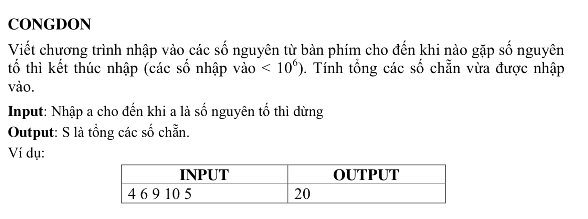

# Bài Tập Cộng Dồn 



## Bài Làm 

### Phân Tích

Trong bài có yêu cầu là nhập dãy số đến khi gặp số nguyên tố thì dừng lại và tính tổng các số chẳn
vậy:
* Số nguyên tố là: Số tư nhiên chỉ chia hết cho chính nó và 1
* Số 1 không phải là số nguyên tố,
* Số 2 là số nguyên tố nhỏ nhất.

nên ta cần 1 hàm kiểm tra xem số vừa nhập là số nguyên tố hay không ? bằng cách loop từ 2 -> đến căn bậc 2 của chính nó, nếu nó chia hết cho số nào đó khác thì dó không phải là nguyên tố
cái này mình tham khảo Wiki - Eratosthene https://vi.wikipedia.org/wiki/S%E1%BB%91_nguy%C3%AAn_t%E1%BB%91 

* Sau khi kiểm tra đó chính là số nguyên tố thì ta dừng chương trình nhập, chuyển sang hàm tính tổng các số chẳn.
* Ta có thể lưu các số vừa nhập vào 1 mảng, rồi sau đó tìm số chẳn (nếu nó chia hết cho 2), hoặc tính trưc tiếp tổng sau khi kết thúc nhập từng số.

### C++

```c++
/*
 Congdon
 @Toan Nguyen Dinh 2018 CNTT04 UED.
 */


#include <iostream>
#include "math.h" // ham tinh toan (su dung can bac 2 trong bai toan)
using namespace std;


int n; // Là số tự nhiên nhập từ bàn phím
int tong; // là Tổng các số chẳn.

/*
 Ham kiem tra xem co phai la so nguyen to hay khong
 Neu dung => true
 neu sai => false
 */
bool snt(int x){
    
    bool v = true;
    
    // neu x < 2 thi day khong phai la so nguyen to
    if(x < 2){
        return false;
    }
    if(x == 2){
        
        return true;
    }

    
    // kiem tra tu 2 -> can bac 2 cua chinh no
    double tmp = double(x);
    for (int i = 2; i<= int(sqrt(tmp)); i ++) {
        
        if(x % i == 0){
            // neu n chia het cho 1 so i bat ky thi khong phai la so nguyen to
            v = false;
            break ; // dung loop
        }
    }
    
    return v;
}

/*
 Hàm nhập giá trị n từ bàn phím
 */

void nhap(){
    
    
    cout << "Nhap vao giá trị n: ";
    
    cin >> n;
    
    // sau khi nhập giá trị n, ta kiểm tra xem n có phải là số nguyên tố hay không, nếu là số nguyên tố, thì dừng, và tính tổng. Còn không phải thì tiêp tục nhập

    if(snt(n) == true){
        // la so nguyen to
        // kiêm tra xem n có phải là số chẳn hay không, nếu số chẳn thì cộng vào
        
        if(n %2 == 0){
             tong += n; // cái này chỉ áp dụng cho số 2 vì số 2 là số nguyên tố chẳn duy nhất
        }
       
        // In ra man hinh tong cac so chan
        cout << "\nTổng các số chẳn mà bạn đã nhập là: " << tong;
    }else{
        
        // bat đầu kiểm tra xem có phải là số chẳn hay không
        if(n %2 == 0){
            tong += n;
        }
        
        // tiep tục nhâp:
        nhap();
        
        
    }
   

}

int main (){
    
    nhap();
    
   return 0;
}


```