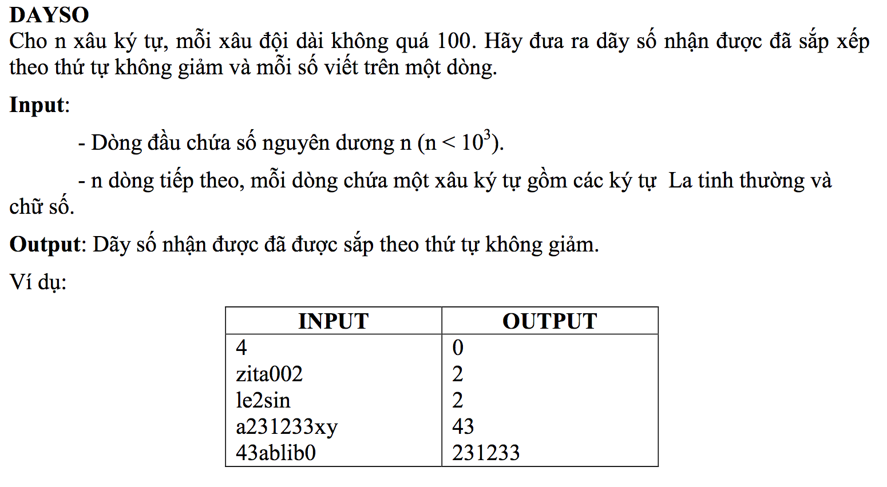

# Day So



## C++

```c++

/*
 Nguyen Dinh Toan 18CNTT04
 user008
 
 */


#include <iostream>
#include <string>
#include <math.h>

using namespace std;

int charToNum(char c){
    
    int charNum[10] = {48,49,50,51,52,53,54,55,56,57};
    
    for (int i=0; i<10; i++) {
        if(charNum[i] == c){
            return i;
        }
    }
    
    return 0;
}

int stringToNumber(string s){
    
    int sNum = 0;
    
    
    int muLuyThua = 0;
    
    for (int i = (int)( s.size() - 1); i >= 0; i--) {
        int num = charToNum(s[i]);
        
        
        
        sNum += num * (pow(10, muLuyThua));
        
        muLuyThua++;
    }
    return sNum;
    
}


int main (){
    
    
    string s =  "";
    
    int N = 1;
    
   
    cin >> N;
    
    int arr[N][100];
    int lengthArr[N];
    int arrResult[N];
    
    

    int increaseStringIndex = 0;
    
    for (int i =0; i<N; i++) {
        
        string stringTmp = "";
        cin >> stringTmp;
        
        
        
        int stringSize = 0;
        
        
        for (int j =0; j<= stringTmp.size(); j++) {
           
            
            
            char ch = stringTmp[j] ;
        
            if(ch >= 49 && ch <= 57){
                
            
              
                s += ch;
                
                
                arr[i][stringSize] = increaseStringIndex;
                
                increaseStringIndex ++;
                
               stringSize ++;
       
                
            }
           
            lengthArr[i] = stringSize;
            
            
        }
        
        
        
    }
   
    
    for (int i =0; i<N; i++) {
        
        
        int subArrLength = lengthArr[i];
        
        
        string tmp = "";
        
        
        for (int k = 0; k<subArrLength; k++) {
            
            int nn = arr[i][k];
            
        
            char ch = s[nn];
            tmp += ch;
            
            
            
        
        }
        
        
        
        int theNumber = stringToNumber(tmp);
        
       // cout << theNumber << endl;
        arrResult[i] = theNumber;
        
    }
    
    
    // sau khi da co mang arrResult gom cac so ta tien hanh sap xep theo thu tu tang dan

    for (int i = 0; i< N ; i++) { // vi moi dong deu co 1 chu so va chu cai, nen ta chon i <N
        // sap xem theo cach don gian nhat (lau nhat)
        for (int j=i; j< N; j++) {
            if(arrResult[j] < arrResult[i]){
                const int minNum = arrResult[j];
                arrResult[j] = arrResult[i];
                arrResult[i] = minNum;
                
            }
        }
    }
    
    // output
    
    cout << 0 <<endl;
    for (int i =0; i< N; i++) {
        cout << arrResult[i] << endl;
    }
    
    
    
    return 0;
    
}


```