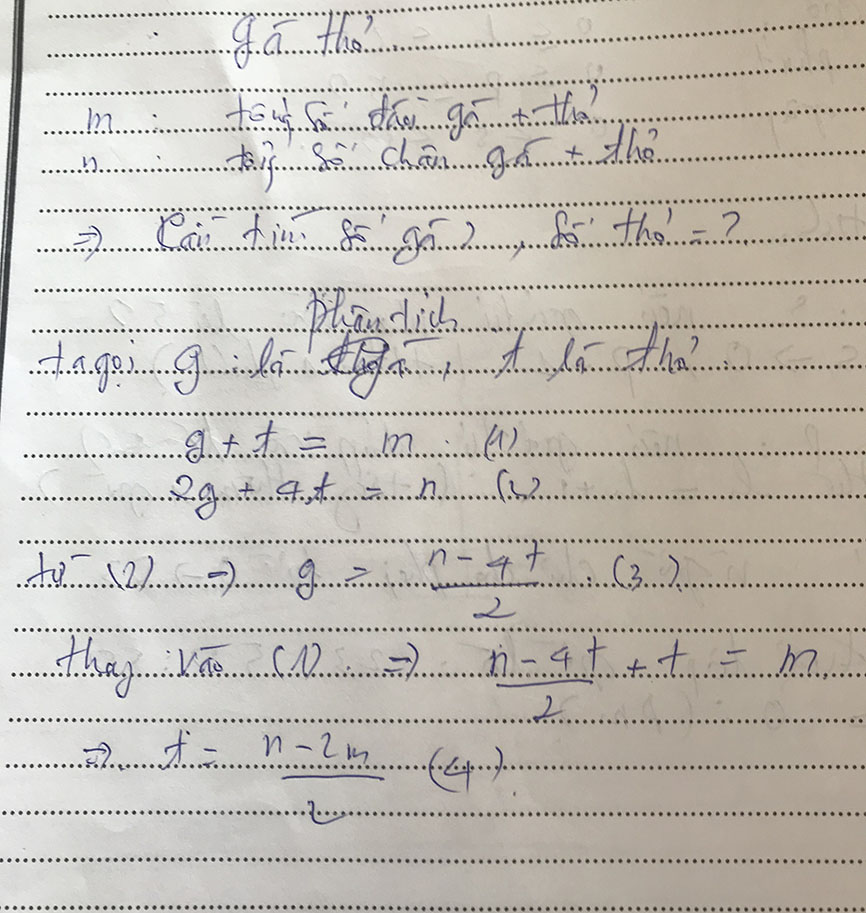

# Bai Toan Gà & Thỏ


## Bài làm

### Phân tích



### C++

```c++
/*
 Bai Tap Ga & Tho
 @Toan Nguyen Dinh 2018 CNTT04 UED.
 */


#include <iostream>

using namespace std;


int m,n; // m = Tong so dau ga + tho, n = tong so chan ga + tho
int g,t; // g = ga, t = tho

int main (){
    

    cout << "Nhap tong So dau ga + tho m: ";
    cin >> m;
    
    cout << "Nhap tong so chan ga + tho n: ";
    cin >> n;
    
    // kiem tra gia tri nhap vao la so nguyen khong am >=0
    if (m < 0 || n <0) {
        
        cout << "Khong co dap an: -1 \n";
        
        return 0;
    }

    //tim so tho
    t = (n-2*m)/2;
    
    
    // tim so ga
    g = (n - 4*t)/2;
    
    // kiem tra lan cuoi neu gia tri ga va tho < 0 thi output la -1
    if(g <0 || t < 0){
        cout << "Khong co ket qua: -1 \n";
        return 0;
    }
    cout << "So Ga: " << g;
    cout << "\n";
    cout << "So Tho: " << t;
    
    
    
    return 0;
}

```