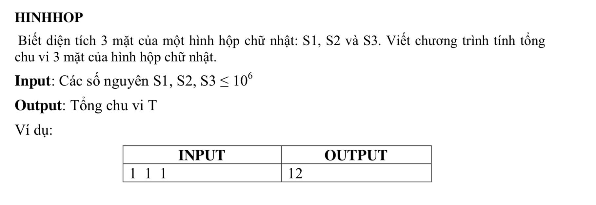
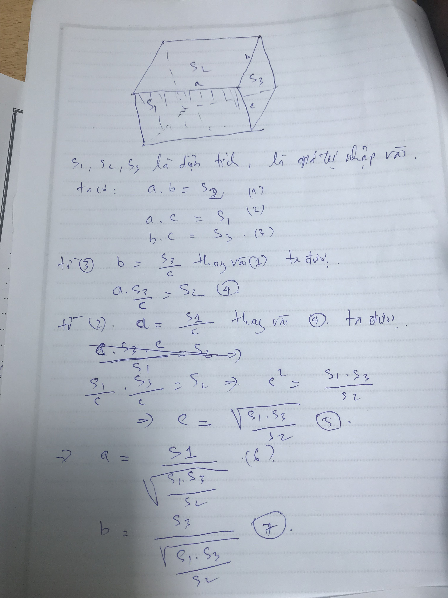

# Bài tập Hình Hộp C++

## Đề bài:



##  ---------------- Bài làm --------------------

### Tìm cạnh a, b,c 



### C++

```c++
/*
 Giai bai tap hinh hop
 cho nhap vao dien tich s1,s2,s3,
 Tinh tong chu vi 3 mat
 
 chu vi: p = (a+b)*2
 
 @Toan Nguyen Dinh 2018 CNTT04 UED.
 */


#include <iostream>
#include <math.h>

using namespace std;


int s1,s2,s3; // dien tich 3 mat cua hinh hop
int p1,p2,p3; // chu vi cua 3 mat hinh hop
int a,b,c; // lan luot la 3 canh cua hinh hop
int t; // Tong chu vi 3 mat cua hinh hop


int main (){
    
    cout << "Nhap S1: ";
    cin >> s1;
    cout << "Nhap S2: ";
    cin >> s2;
    cout << "Nhap S3: ";
    cin >> s3;
    
    /*
     Tinh canh a,b,c theo cong thuc da giai toan o tren
     */
    c = sqrt(s1*s3/s2);
    
    a = s1/c;
    b = s3/c;
    
    /* Tinh chu vi p1,p2,p3
     */
    p1 = (a+c)*2;
    p2 = (a+b)*2;
    p3 = (b+c)*2;
    
    // Tong chu vi 3 mat
    
    t = p1 + p2 + p3;
    
    cout << "Tong chu vi 3 mat cua hinh hop chu nhat la: " << t;
    
    
    return 0;
}


```