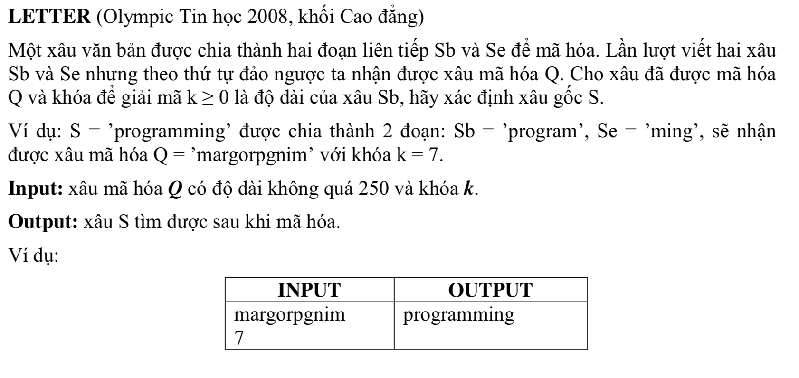

# LETTER



## c++

```c++

/*
 Nguyen Dinh Toan 18CNTT04
 user008
 
 */


#include <iostream>
#include <string>

using namespace std;

// s = "margorpgnim";

int main(){
    

    int k;
    
    string s("");
    cin >> s;
    cin >> k;
    string decodedString = "";
    
    int rightLength = ((int) s.size()) - k;
    char b[k];
    char e[rightLength];
    
    
    
    int bInc = 0;
    int eInc = 0;
    
    for (int i = (int)s.size(); i >=0; i--) {
        if(i > (k-1)){
        
            e[eInc] = s[i];
            
            eInc ++;
            
            
            
        }else{
            // left string
        

            b[bInc] = s[i];
            bInc ++;
            
            
            
            
        }
    }
    
    
    // begin string
    for (int i = 0; i< bInc; i++) {
    
        decodedString += b[i];
    }
    
    // end string
    for (int i = 0; i < eInc; i++) {
        
        decodedString+= e[i];
        
    
    }
    
   cout <<s <<":"<< decodedString;
    
    return 0;
}


```