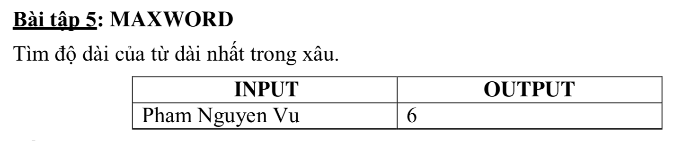

# MAXWORD



## C++

```c++

/*
 MAXWORD
 Teacher: TS.Pham Anh Phuong UED.
 Student: Nguyen Dinh Toan 18CNTT04
 */

#include <iostream>
#include <string>

using namespace std;

string s("Pham Nguyen Vu");

int main (){
    
    int count = 0;
    int max = 0;
    
    for (int i =0; i<s.size(); i++) {
        if(s[i] == 32){
            // gap khoang trang
            if(count > max){
                max = count;
            }
            count = 0;
            
        }else{
            count ++;
        }
    }
    

    
    cout << max;
}


```