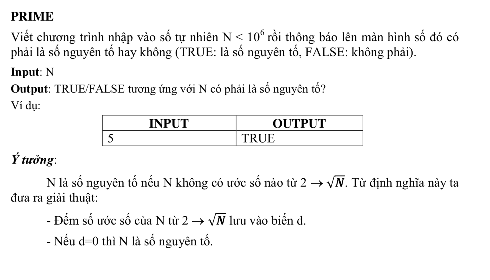

# Prime 



## C++

```c++

/*
 Prime
 @Toan Nguyen Dinh 2018 CNTT04 UED.
 */


#include <iostream>
#include "math.h"

using namespace std;


int main (){
    
    int n; // biên n nhập vào từ bàn phím
    bool snt = true;
    
    cout << "Nhập n: ";
    
    cin >> n;
    
    if(n < 2){
        snt = false;
    }else{
        double tmp = (double) n;
        
        for (int i = 2; i <= int(sqrt(tmp)); i++) {
            if(n % i == 0){
                snt = false;
                
                break;
            }
        }
        
        if(snt){
            cout << "TRUE";
        }else{
            cout << "FALSE";
            
        }
        
    }
    
    
    
   return 0;
}


```