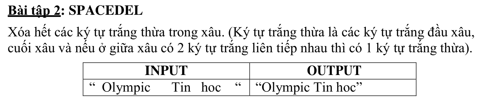

# SPACEDEL



## C++

```c++

#include <iostream>
#include <string>
using namespace std;


int main(){
    
    
    
    string s = " Olympic  Tin hoc  ";
    string str = "";
    string result = "";
    
    
    
    for (int i = 0; i< s.size(); i++) {
        
    
       
        if(s[i] == 32){
            if(i == 0){
                continue; // khong lay ky tu trang dau tien
            }
            if(i == s.size()){
                continue; // ko lay ky tu trang cuoi cung
            }
            
            
            int lastIndex = int(i-1);
            
            if(s[lastIndex] != 32 && i != s.size()){
                
                str += " ";
            }
            
        }else{
        
            str += s[i];
            
            
        }
        
       
        
    }
    

    
    size_t max = str.size();
    
    // kiem tra lan cuoi ben phai
    if(str[(max-1)] == 32){
        max --;
    }
    
    for(int i = 0; i<max; i++){
        
        result += str[i];
    }
    cout << "Ket Qua:"<< result;
    

}


```