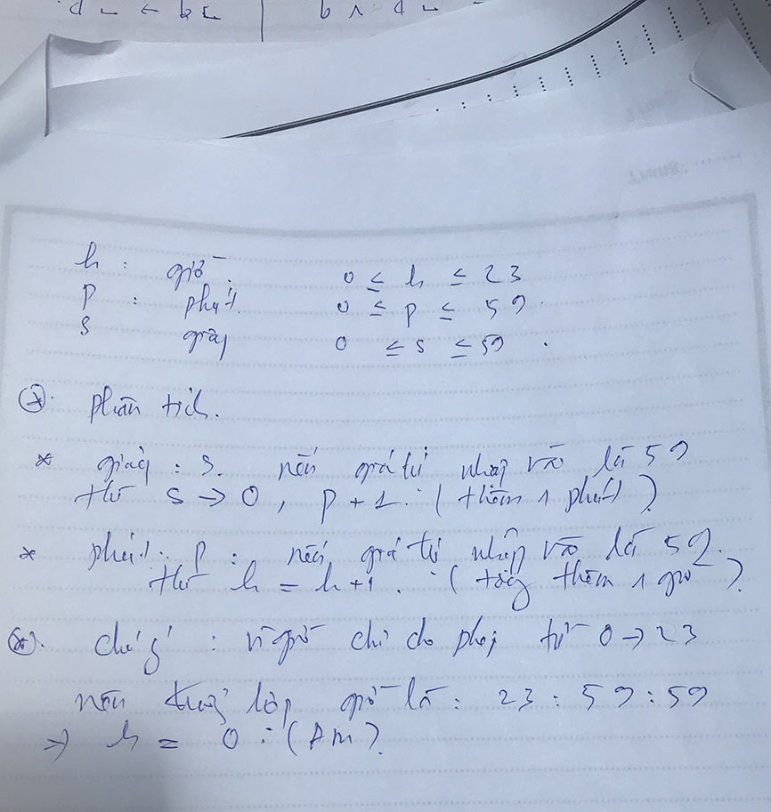

# Bài Time 


## Bài làm

### Phân tích



### C++


```c++
/*
 Bai Tap Time
 @Toan Nguyen Dinh 2018 CNTT04 UED.
 */


#include <iostream>

using namespace std;

int h,p,s; // Gio, Phut, Giay


bool validation(){
    
    if (h>=0 && h<= 23 && p >=0 && p<= 59 && s >= 0 && s <= 59){
        return true;
    }
    return false;
    
    // co the rut gon bang return (h>=0 && h<= 23 && p >=0 && p<= 59 && s >= 0 && s <= 59);
}

int main (){
    
    cout << "Nhap Gio h: ";
    cin >> h;
    
    cout << "Nhap phut p: ";
    cin >> p;
    
    cout << "Nhap Giay s: ";
    cin >> s;
    
    if(!validation()){
        cout << "Gia tri nhap khong thoa man yeu cau bai toan.";
        cout << "Điều kiện phải thoả mãn như sau \n";
        cout << "0 <= h <= 23\n";
        cout << "0 <= p,s <= 59\n";
    
        return 0;
    }
    
    // bat dau tinh toan hien thi
    
    // xet dieu kien giay truoc
    s+= 1;
    
    if(s == 60){
        s = 0;
        p+= 1;
        
    }
    // tiep tuc xet dieu kien phut
    if (p == 60){
        p = 0;
        h += 1;
    }
    // kiem tra lai gio h, neu gio la 24 thì trả về giá trị 0 , vi bài toán chỉ cho phép giờ từ 0 -> 23, (AM)
    if(h == 24){
        h = 0;
    }
    
    // bat dau hien thi
    
    cout << "Thoi gian sau khi ban nhap la: " << h << ":"<< p << ":" << s;
    
    return 0;
}


```