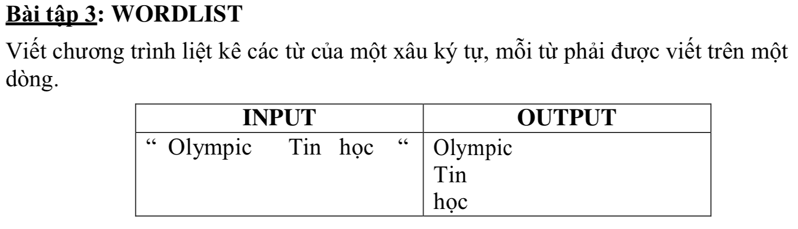

# WORD LIST



## C++

```c++
/*
 Word list
 Teacher: TS.Pham Anh Phuong UED.
 Student: Nguyen Dinh Toan 18CNTT04
 */
#include <iostream>
#include <string>

using namespace std;

string s = " Olympic  Tin học  ";
string result = "";


int main(){
    
    bool lastIsSpace = true;
    
    for (int i=0; i<s.size(); i++) {
    
        if(s[i] == 32){ // gap khoang trang
            if(!lastIsSpace){
                
                 result += "\n"; // Xuong dong
                 lastIsSpace = true;
            }
           
            
        }else{
            lastIsSpace = false;
            result += s[i];
        }
    }
    
    cout << result;
    return 0;
}


```